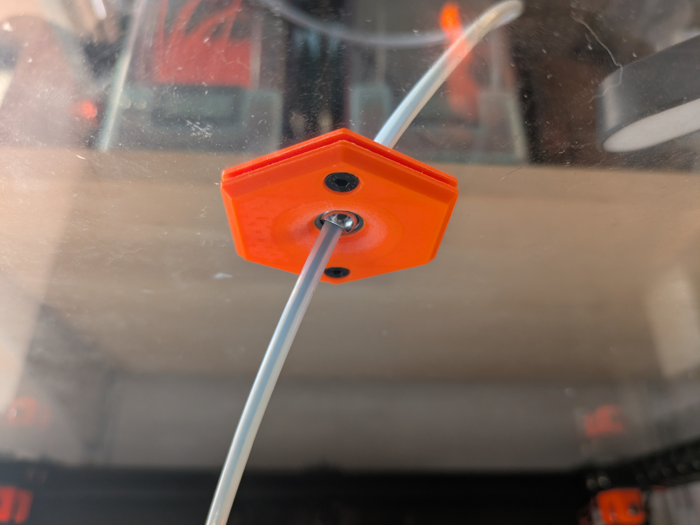

Low-Profile GE4C Bowden Tube Passthrough for 3 mm Panels
========================================================

This is a from-scratch redesign of ["PTFE/Bowden Tube Passthrough with GE4C Spherical Bearing" by Mark Norris](https://www.printables.com/model/795052-ptfebowden-tube-passthrough-with-ge4c-spherical-be). It retains the same footprint and hole spacing for full compatibility while introducing key improvements.

[View on Printables](https://www.printables.com/model/1174655-low-profile-ge4c-bowden-tube-passthrough-for-3mm-p)

## Design Goals

- **Full Range of Motion**
  The passthrough is designed for a **12 mm hole** in a **3 mm thick panel**, ensuring that the GE4C spherical bearing's _center of rotation_ is precisely aligned between the inside and outside surfaces. This maximizes the bearing's range of motion.
- **Minimalist Exterior**
  The top half features **heat-set inserts** for M3 screws, ensuring the **outside remains smooth** with no exposed holes.
- **Minimal Interior Profile**
  The bottom half is only **3 mm thick**, keeping it as compact as possible to minimize interference with the Bowden tube inside the enclosure. The other half is slightly thicker to accommodate the heat-set inserts.
- **Smooth Filament Path**
  The edges around the bearing hole are **gradually sloped**, preventing the Bowden tube from catching or kinking when moving against the printed surface.

## BOM

- 1x **GE4C bearing** (i.e. 12x3 mm outer ring dimensions)
- 2x **M3x8 mm FHCS** (but M3x10 mm FHCS should fit too)
- 2x **M3x5x4 mm Heat-set Insert**

## Print Settings

I recommend printing with **standard _Voron_ settings**, but **variable layer height** improves curved surface finish if your slicer supports it. A lower infill density may also work.

- **Layer height**: 0.2mm
- **Extrusion width**: 0.4mm, forced
- **Infill percentage**: 40%
- **Infill type**: grid, gyroid, honeycomb, triangle, or cubic
- **Wall count**: 4
- **Solid top/bottom layers**: 5
- **Supports**: _none_

## Notes

- The halves **are _not_ symmetrical** — be sure to orient them correctly when assembling.
- I recommend making a small pilot hole using the drill template, then using a **stepped drill bit** to gradually widen it to **12 mm** for the best fit.
- A bearing press-fit is optional since the printed halves will secure the bearing, but minimizing lateral play is still recommended.
